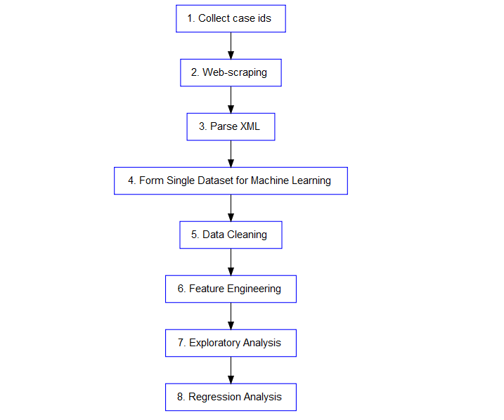

# Introduction
<!--
    First, provide the context of the problem and then state the problem (your main research question). 
    Second, write briefly that what are you proposing to solve this problem (don't write details of the 
    solution here). (You can use part of your abstract here)
-->

Automotive accidents result in over 30,000 fatalities in the United States annually [[1]](http://www.who.int/violence_injury_prevention/road_safety_status/2015/TableA2.pdf?ua=1).
The National Automotive Sampling System (NASS) provides a nationally representative sample of police reported collisions and is made available to researchers and the general public.
    
The research question for this project is to identify and quantify factors which impact the survivability of various crash types (rear-end, sideswipe, etc) using R, and create a web app using the shiny package to predict survivability for given inputs using regression.
    
The techniques will include web-scraping the publicly available data on the NASS website, parsing the resultant XML and data cleaning of real-world dataset, exploratory analysis to identify relevant factors, feature engineering, and regression.

The source code for this project is available on github at https://github.com/gmyrland/capstone_project.

**References:**

[1] World Health Organization. (2015). Global status report on road safety 2015. Accessed from\newline http://www.who.int/violence_injury_prevention/road_safety_status/2015/TableA2.pdf?ua=1

# Literature Review
<!--
    Write summary of the related papers that you reviewed here.  Write the summary in your own 
    words - don't use the technical jargon from the paper that you don't understand. Keep this section 
    short -  short paragraph or few sentences about each paper you reviewed should be sufficient.
-->

Several publications were reviewed with emphasis being placed on determining potential factors which may have significant effects on vehicle crash survivability.

An Indiana University paper (2014) noted that vehicle inequalities (e.g., height, rigidity, weight) had a significant impact on survivability in head-on collisions.
This driver survival risk factor study found that "the driver's chance of survival was increased by driving a vehicle with a higher mass, driving a newer vehicle, being younger, being a male, using a seatbelt and having the airbag deployed in the crash."&nbsp;[[2]](http://www.eurekalert.org/pub_releases/2014-11/iu-ccs111814.php)

Some studies examined the effect of vehicle age on survivability. 
For example, an Association for the Advancement of Automotive Medicine study (2006) showed decreases in the casualty rate for newer cars in frontal impacts.&nbsp;[[3]](http://www.ncbi.nlm.nih.gov/pmc/articles/PMC3217489/)

A 2014 conference paper examined the risk factors associated with the survival of drivers in head on collisions.
In order to control for vehicle speed, vehicles involved in head-on collisions were paired and logistic regression was used to model the effect of other factors such as vehicle mass, vehicle age, and passenger demographics.&nbsp;[[4]](https://www.researchgate.net/publication/266775960_Factors_affecting_survival_in_head-on_vehicle_collisions)

Finally, the World Health Organization report on road traffic injury prevention (2004) identified speed as a key risk factor in road traffic injuries.
Further, driver speed choice was found to be influenced by a number of factors, including:
driver-related factors such as age, gender, alcohol level, and number of people in the vehicle; road and vehicle factors such as road layout, surface quality, vehicle power, and maximum speed; and traffic- and environment-related such as traffic density and composition, prevailing speed, and weather conditions.&nbsp;[[5]](http://www.who.int/violence_injury_prevention/publications/road_traffic/world_report/speed_en.pdf)

**References:**

[2] Indiana University. (2014). Car crash survival rates increase with being younger, male and driving a big vehicle. Accessed from http://www.eurekalert.org/pub_releases/2014-11/iu-ccs111814.php

[3] Frampton, R., Page, M., & Thomas, P. (2006). Factors Related to Fatal Injury in Frontal Crashes Involving European Cars. Annual Proceedings / Association for the Advancement of Automotive Medicine, 50, 35–56. 

[4] Kirbiyik, U., Dixon, B., & Zollinger, T.W. (2014). Factors affecting survival in head-on vehicle collisions. 142nd APHA Annual Meeting and Exposition 2014. Accessed from https://www.researchgate.net/publication/266775960_Factors_affecting_survival_in_head-on_vehicle_collisions

[5] World Health Organiztion. (2004). World report on road traffic injury prevention. Accessed from http://www.who.int/violence_injury_prevention/publications/road_traffic/world_report/speed_en.pdf

# Dataset
<!--
    Give the description of the dataset that you are using along with the individual attributes you will or will 
    not use in your analysis. Also mention the source of the dataset (where did you get it from). In case the 
    data is curated and created by you please explain the details. Descriptive statistics of the attributes and 
    datasets can also be provided here.
-->

The data used for this project can be found at http://www.nhtsa.gov/NASS. The section "*NASS CDS Case Viewer - XML Viewer (2004-Present)*" provides a search interface of the existing case data.
When a case id is known, it can be used to extract XML data for the specific collision, allowing for collection of all case data.

>   ``Information collected in NASS, with all personal identifiers removed, is made available to other researchers and organizations involved in the highway safety effort. They include other Federal agencies; state and local governments; universities; research institutions; the automobile, trucking, and insurance industries; and the general public'' ([National Automotive Sampling System, 2008]((http://www.nhtsa.gov/DOT/NHTSA/NCSA/Content/PDF/NASSbrochure.pdf))).

The specific dataset used for analysis in this project is formed by extracting key attributes from the raw XML case data as explained in the approach section below.

<!-- descriptive statistics and attributes used -->
The attributes used include: NumOfVehicle, CrashDate (Month, Year), CrashTime, DayOfWeek, CrashType, Configuration, AreaOfDamage, Contacted, ContactedClass, VehicleYearVehicleMake, VehicleModel, VehicleDamagePlane, VehicleSeverity, OccupantRestraints, OcupantMaxSeverity, OccupantInjurySource, Conditions, etc.

Attributes not used include: metadata such as CaseStr (a string case identifier) and paths to image files, EMS data such as type of care administered, detailed vehicle damage information, towing information, accident reconstruction calculated values, detailed restraint information, injuries other than fatalities, and other detailed information beyond the scope of this project.

```{r fig1, echo=FALSE, message=FALSE, fig.height=3.5, fig.width=8, fig.cap="Counts of the various crash configurations."}
wd <- setwd("..")
library(dplyr)
library(xml2)
library(DBI)
library(RSQLite)
source("R/database.R")
df <- read_db()
library(ggplot2)
df %>%
    filter(config != '') %>%
    ggplot(aes(x=config)) +
        geom_bar(fill="#0047b3") +
        labs(x = "Configuration", y="Count") +
        theme_bw() +
        theme(axis.text.x = element_text(angle = 30, hjust=1))
setwd(wd)
```


# Approach
<!--
    Create a block diagram for the steps of your approach to clearly provide an overview. For example, if 
    you first scrapped twitter, second applied NLP techniques to extract keywords, third labelled the tweets 
    as positive and negative using a set of keywords, and fourth build a classifier, then you should create a 
    box for each of the steps with arrows connecting one step to the next one. A sample block diagram is 
    shown below.
    Once this is done, explain each of the steps in detail. What are you planning to do in each step or have 
    already done. For example, in the above case you would create subheadings for each of the steps.  
-->

```{r include=FALSE, eval=FALSE}
library(dplyr)
library(DiagrammeR)
graph <-
  create_graph() %>%
  set_graph_name("Approach") %>%
  set_global_graph_attr("graph", "overlap", "true") %>%
  set_global_graph_attr("graph", "fixedsize", "true") %>%
  set_global_graph_attr("node", "color", "blue") %>%
  set_global_graph_attr("node", "fontname", "Helvetica") %>%
  add_node(label="  1. Collect case ids  ") %>%
  add_node(label="  2. Web-scraping  ", from=1) %>%
  add_node(label="  3. Parse XML  ", from=2) %>%
  add_node(label="  4. Data Cleaning  ", from=3) %>%
  add_node(label="  5. Exploratory Analysis  ", from=4) %>%
  add_node(label="  6. Feature Engineering  ", from=5) %>%
  add_node(label="  7. Regression Analysis  ", from=6) %>%
  select_nodes() %>%  
  set_node_attr_with_selection("shape", "box") %>%
  set_node_attr_with_selection("type", "box") %>%
  clear_selection %>%
  select_edges %>%
  set_edge_attr_with_selection("color", "black") %>%
  clear_selection
render_graph(graph)
## graph produced saved using RStudio as approach.png
```
The approach to be taken is shown in the graph below, and is described in the following subsections.


## Step 1: Compile complete list of case ids
<!--
    Write details of the step 1. If there is any source code that you'd like to share then provide the link of 
    the Github.
-->

Case data in XML for each collision can be found using a url of the form:\newline http://www-nass.nhtsa.dot.gov/nass/cds/CaseForm.aspx?GetXML&caseid=112007272.

In order to obtain data for each collision, it was necessary to obtain all case ids.
As there was no obvious source for the complete set of ids, and the numerical values of the ids were too sparse for brute-force web scraping, a method was devised to quickly pull all ids from a search results list containing all cases.

The complete set of results can be found using the link http://www-nass.nhtsa.dot.gov/nass/cds/ListForm.aspx and clicking "*Search*".

A Windows application [True X-Mouse Gizmo](http://fy.chalmers.se/~appro/nt/TXMouse/) was used to emulate the Linux behaviour of copying any selected text to the system clipboard.
A macro in the [vim](http://www.vim.org/) text editor was then used to paste the clipboard contents to a text file at a rate of once per second.
Navigating through the result list and selecting all text allowed for quick harvesting of all 49,345 case ids in an unstructured format ([nass_case_ids.txt](https://github.com/gmyrland/capstone_project/blob/master/data/nass_case_ids.txt)).
The result was then filtered for only unique lines containing the regular expression "`[0-9]{9}$`", again using vim.
This provided the original tabular result data in a tidy, tab-delimited file, with the last field being the case id ([nass_case_ids_filtered.txt](https://github.com/gmyrland/capstone_project/blob/master/data/nass_case_ids_filtered.txt)).

## Step 2: Scrape case data using case ids

Using R, the case data was scraped from the NASS website and stored locally as XML. 
Two functions were written to perform the web scrape and are located in [R/scrape.R](https://github.com/gmyrland/capstone_project/blob/master/R/scrape.R).
Given a single case id, `download_case` downloads the case data and saves it as a single text file containing XML with the case id as the name. The function `download_all_cases` uses `download_case` to iteratively download all cases.
If local data already exists for any case, then the case data is not re-downloaded.

## Step 3: Rectangularize key XML fields

Using the [xml2](https://cran.r-project.org/web/packages/xml2/index.html) package in R, key fields in the XML tree can be read and stored to a data frame.
The `parse_xml` function in [R/parse.R](https://github.com/gmyrland/capstone_project/blob/master/R/parse.R) iterates through the local case data files and produces a single data frame containing the key fields.

## Step 4: Data Cleaning

The data collected is real world data and contains missing values.
Furthermore, as it has been collected over time, the XML schema has changed yearly.
Coding and Analytical Manuals for the data are located [here](http://www-nrd.nhtsa.dot.gov/cats/listpublications.aspx?Id=l&ShowBy=DocType), and will be used to reconcile the data to a consistent schema.
Additionally, missing fields may need to be imputed or have corresponding records removed from the data set.

## Step 5: Exploratory Analysis

Once the data is cleaned, exploratory analysis can take place.
This will include searching for existing correlations in the data as well as identification of attributes that will likely be useful in the regression analysis.

## Step 6: Feature Engineering

If required, attributes may need to be re-factored or engineered to provide better inputs to the regression.

## Step 7: Regression

Finally, a regression will be performed to build a model to predict survivability of collisions given the inputs identified in the previous steps.

# Results
<!--
    Explain you results here. Consider that you need to communicate your results to executives in an
    organization. For example:
        1. Insert tables and/or charts showing the results
        2. Write description of the table and charts, such that they show the usefulness for an organization
        3. Identify the evaluation measures, such as accuracy, precision, recall, etc.
-->
- describe transformations (above)
- table with chosen features, class, n-unique
- violin plot of several features
- data partitioning
- machine learning approaches
 - break data by crash type
- confusion matrix
- 

# Conclusions
<!--
    Give a short summary (one or two paragraphs) of your analysis and conclude the discussion by defining
    the usefulness of your analysis.
-->
- accuracy, etc
- which features were most imporatant
